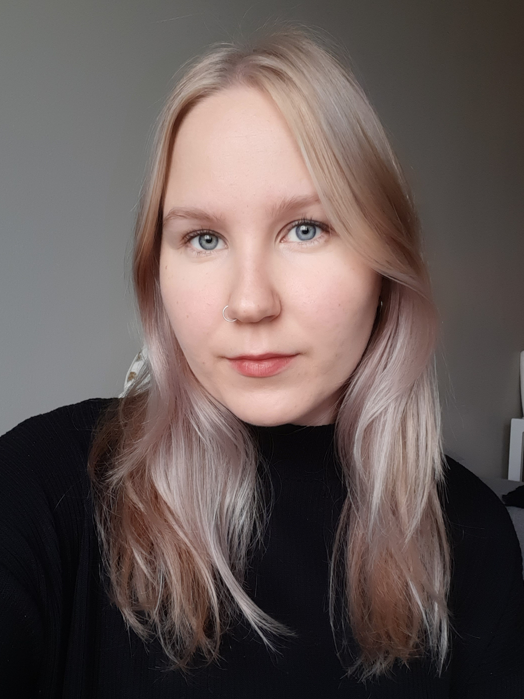

## Introduction

 I am a student at the University of Helsinki, set to graduate in the fall semester 2022. Although I started out as an English student, my main interest is in language technology. I have completed courses in english philology, linguistics and language technology. In my free time I love to get creative and take photographs, knit and play piano, as well as enjoy the outdoors by walking, running and hiking. From time to time I also love to travel.

## CV

[Here](assets/documents/CV.pdf) you can download my CV.

## Find me on

[LinkedIn](https://www.linkedin.com/in/anni-moisala-a72086103/), [GitHub](https://github.com/annieriika)

## Contact

anni.moisala@helsinki.fi. 

## Courses I've Taken

[Coursera: Deep Learning](https://www.coursera.org/learn/neural-networks-deep-learning), certificate available 

[Speech Analysis Methods](https://studies.helsinki.fi/opintotarjonta/cur/hy-opt-cur-2223-e52b4301-d7ae-4b09-9640-aa0ebd591819), fall 2022

[Command Line Tools for Linguists](https://studies.helsinki.fi/courses/cur/hy-opt-cur-2223-261401a1-c550-4436-91b9-7edf4a1a3b57/%E2%90%9FKIK%E2%90%9F-%E2%90%9FLG%E2%90%9F%E2%90%9F221%E2%90%9F/Command_Line_Tools_for_Linguists_exercise_session_Lectures), fall 2022

[Introduction to Language Technology](https://studies.helsinki.fi/opintotarjonta/cur/hy-opt-cur-2223-43b8f122-8ca2-453b-addd-cbfd756c3306/%E2%90%9FKIK%E2%90%9F-%E2%90%9F405%E2%90%9F/Introduction_to_Language_Technology_Luento_opetus), fall 2022

[Programming for Linguists](https://studies.helsinki.fi/courses/cur/hy-opt-cur-2223-2b1a1c0f-9701-4397-9e19-ab80b0c87af4/%E2%90%9FKIK%E2%90%9F-%E2%90%9FLG%E2%90%9F%E2%90%9F208%E2%90%9F/Ohjelmointia_lingvisteille_Programming_for_linguists_Lectures), spring 2022

[Mathematics for Linguists](https://studies.helsinki.fi/courses/cu/hy-CU-117878775-2021-08-01/KIK-LG209/Mathematics_for_Linguists), spring 2022

[Machine Translation](https://studies.helsinki.fi/courses/cur/hy-opt-cur-2223-26b09c08-e399-491a-80ce-a612817c0118/%E2%90%9FLDA%E2%90%9F-%E2%90%9FT%E2%90%9F%E2%90%9F306%E2%90%9F/Machine_Translation_Lectures), spring 2022

[Machine Learning for Linguists](https://studies.helsinki.fi/courses/cur/hy-opt-cur-2223-acdde013-f523-42ab-92c2-600d430c0672/%E2%90%9FKIK%E2%90%9F-%E2%90%9FLG%E2%90%9F%E2%90%9F210%E2%90%9F/Koneoppimisen_perusteet_lingvisteille_Lectures), spring 2022

## Projects

[Commandline-course Project](https://github.com/annieriika/cmdline-course). This project taught me how to use Github and it includes books from the gutenberg library, as well as their parsed versions, frequency lists and sentence lists. 

[Neural Machine Translation Final Project.](assets/documents/NMT-final-project.pdf) (Download pdf report.) This project consists training and optimazing three different German to English NMT-models, including pre-processing the data and evaluating the results.

[Machine Learning for Linguists Final Project.](assets/documents/ML-project.ipynb) (Download Notebooks-file.) Comparing Naive Bayes and Neural Networks in Text Categorization of the Brown Corpus.

## Misc. 

[Photography](https://www.instagram.com/anni.eriika/). Here is my instagram page where you can see my photography.